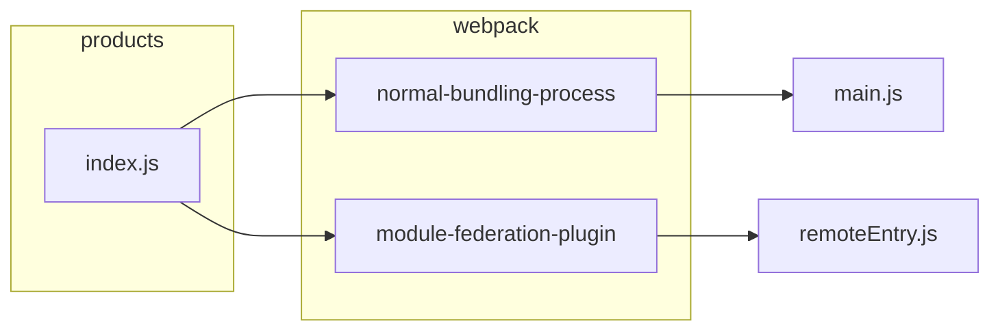
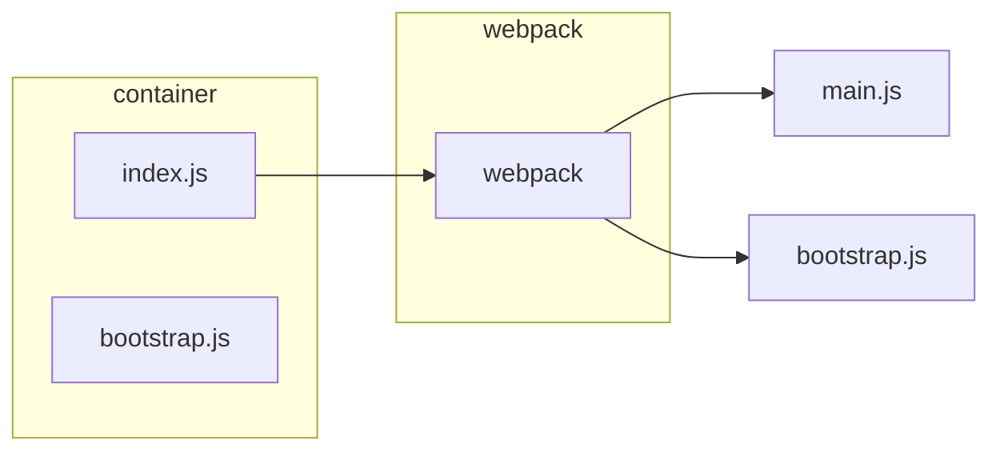

# Microfrontends with React: A Complete Developer's Guide

> 작성일: 2024-06-12  
> 작성자: dusunax  
> 자료: https://www.udemy.com/course/microfrontend-course/learn/lecture/23206822  

---

> 1~19: 레포지토리 Integration의 기초 (webpack)

### Webpack

- remote/webpack.config.js
  - 포트는 8081

```tsx
const HtmlWebpackPlugin = require("html-webpack-plugin"); // 파일에 스크립트 주입할 것
const ModuleFederationPlugin = require("webpack/lib/container/ModuleFederationPlugin");

module.exports = {
  mode: "development",
  devServer: {
    port: 8081,
  },
  plugins: [
    new ModuleFederationPlugin({
      name: "products", // remote를 만들때만 필요하다. 외부에서 알아보기 위함
      filename: "remoteEntry.js", // remoteEntry.js를 템플릿에 주입 (html의 head에 <script defer src="remoteEntry.js"></script>)
      exposes: {
        "./ProductsIndex": "./src/index", // expose할 파일 맵 => container의 bootstrap.js에서 사용할 것
        // ./src/index가 아니라 별칭을 사용하는 이유? 필요없기 때문 (어차피 index.js)
      },
    }),
    new HtmlWebpackPlugin({
      template: "./public/index.html", // main.js를 템플릿에 주입 (html의 head에 <script defer src="main.js"></script>)
    }),
  ],
};
```

- container/webpack.config.js
  - 포트는 8080

```tsx
const HtmlWebpackPlugin = require("html-webpack-plugin");
const ModuleFederationPlugin = require("webpack/lib/container/ModuleFederationPlugin");

module.exports = {
  mode: "development",
  devServer: {
    port: 8080,
  },
  plugins: [
    new ModuleFederationPlugin({
      name: "container",
      remotes: {
        products: "products@http://localhost:8081/remoteEntry.js",
        // 바꿔보기
        // 👉 키랑 bootstrap에서 import하는 경로가 일치야함 (경로 별칭 생각하면 됨)
        // 이렇게도 됨 "@products": "~~",
        // container의 bootstrap의 import: "@products/ProductsIndex"

        // 👉 값의 @앞의 구분자는 remote 이름과 같아야함
        // 이렇게도 됨 "~~": "hello_products@http://localhost:8081/remoteEntry.js",
        // remote의 webpack.config.js의 name: hello_products
      },
    }),
    new HtmlWebpackPlugin({
      template: "./public/index.html",
    }),
  ],
};
```

- container/src/bootstrap.js
  - container의 index.js에서 바로 import 안하는 이유?
  - contianer의 index.js를 실행하기 전 products의 디펜던시를 준비 수 있도록 함

```tsx
import "products/ProductsIndex"; // webpack이 node modules에서 디펜던시를 못 찾으면 => ModuleFederationPlugin에서 products 키를 찾을 것

console.log("Container!");
```

- container/src/index.js

```tsx
import("./bootstrap"); // bootstrap에서 "products/ProductsIndex"을 import 한 후, bootstrap을 import
```

- products => main.js





